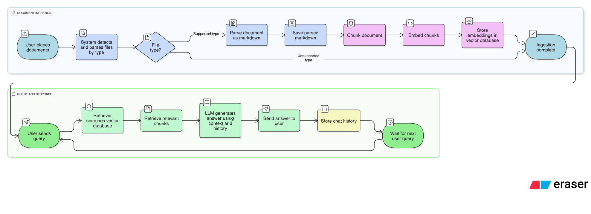
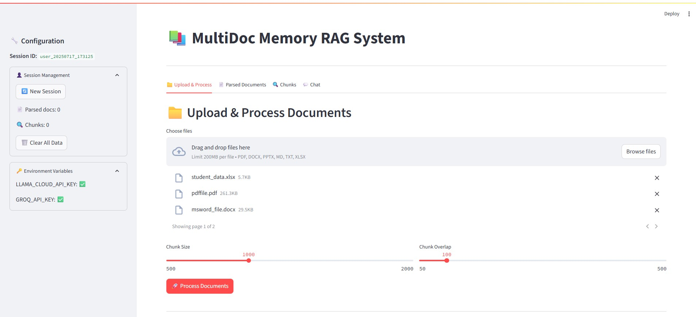
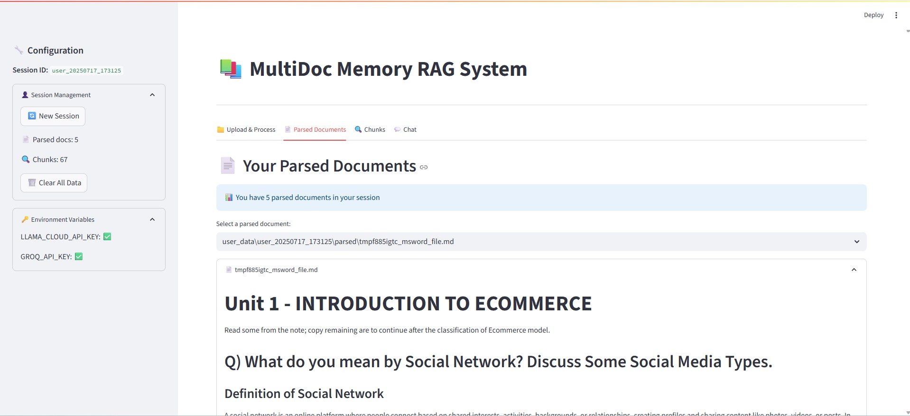
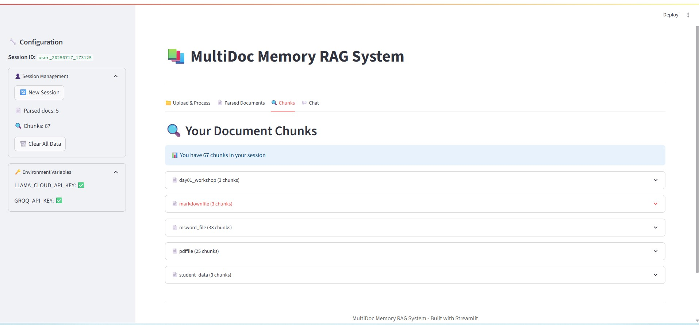
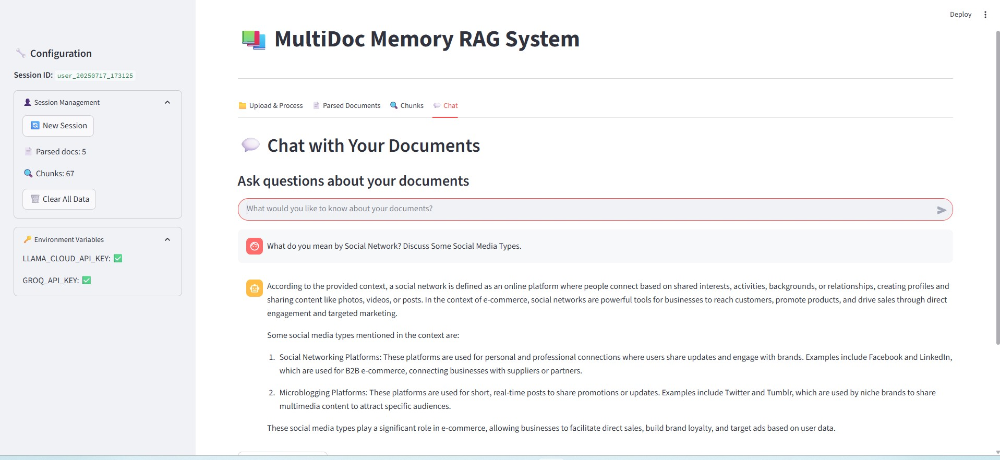

# Multi-Document Memory Chatbot

A powerful multi-document chatbot system that parses various document formats, chunks and indexes the content using vector embeddings, and enables conversational retrieval with memory support across sessions. This project leverages LangChain, LlamaParse, HuggingFace embeddings, Chroma vector store, and the Groq LLM API for a seamless question-answering experience over your documents.

---

## Features

- **Multi-format Document Parsing:** Supports PDF, DOCX, PPTX, XLSX, Markdown, and plain text files. Parses documents into markdown preserving formatting.
- **Fallback Loaders:** Robust fallback document loaders using LangChain community loaders.
- **Document Chunking:** Splits large documents into manageable chunks with overlap for improved context retrieval.
- **Vector Store Indexing:** Uses HuggingFace's `sentence-transformers/all-MiniLM-L6-v2` for embeddings and stores chunks in a persistent Chroma vectorstore.
- **Self-Query Retriever:** Uses LangChain's SelfQueryRetriever to enable semantic search with metadata filtering.
- **Memory-Enabled Chatbot:** Supports multi-turn conversations with persistent chat history stored per session.
- **Custom Prompting:** Configurable prompts ensure answers are strictly based on document context and conversation history, avoiding hallucinations.
- **Integration with Groq LLM API:** Uses `llama-3.1-8b-instant` model from Groq for reliable language generation.

---

## System Flow



## Screenshots

| UI Screen 1 | UI Screen 2 |
|-------------|-------------|
|  |  |

| UI Screen 3 | UI Screen 4 |
|-------------|-------------|
|  |  |

### Prerequisites

- Python 3.8+
- Install required packages:

```bash
pip install langchain langchain_community llama_parse chromadb langchain_groq pandas python-pptx tabulate python-dotenv


* API Keys:

  * `LLAMA_CLOUD_API_KEY` — for LlamaParse API access.
  * `GROQ_API_KEY` — for Groq LLM API access.

Store these keys in a `.env` file in the project root:

```
LLAMA_CLOUD_API_KEY=your_llama_cloud_api_key_here
GROQ_API_KEY=your_groq_api_key_here
```

---


---

## Usage

### 1. Parsing Documents

Place your documents (PDF, DOCX, PPTX, XLSX, MD, TXT) inside the `data/` folder (or your configured source folder).

Run the script to parse all documents, saving markdown files in `Parsed_doc/`.

### 2. Chunking Documents

Each parsed markdown document is split into chunks (default 1000 characters with 100 overlap) and saved in `Chunks_doc/`.

### 3. Vector Index Creation

All chunks are loaded, embedded with HuggingFace embeddings (`all-MiniLM-L6-v2`), and indexed in a persistent Chroma vector store located at `chromadb/`.

### 4. Chatting with Memory

Use the `chat_with_memory(question: str, session_id: str)` function to interact with the chatbot. It maintains chat history per session saved under `memory/`.

Example:

```python
response = chat_with_memory("What is MicroController?", session_id="user123")
print(response)
```

---

## Key Components

### Document Parsing

* Custom parsers for each file type using LlamaParse, LangChain loaders, and python-pptx/pandas for extracting content.
* Fallback loaders for unsupported or failed primary parsing.
* Saves extracted content as Markdown files.

### Chunking

* RecursiveCharacterTextSplitter with prioritized separators for better semantic chunking.
* Saves chunks as separate markdown files.

### Embeddings and Vector Store

* Uses HuggingFace `sentence-transformers/all-MiniLM-L6-v2` for embedding chunks.
* Chroma vector store for efficient similarity search and persistence.

### Retriever

* SelfQueryRetriever that enables advanced semantic search with metadata filters.
* Metadata includes file source name and type.

### Language Model

* Groq LLM (`llama-3.1-8b-instant`) accessed via `langchain_groq.ChatGroq`.

### Chat Interface

* Uses LangChain chat prompts with conversation history placeholders.
* Stores conversation histories per user session using `FileChatMessageHistory`.

---

## Environment Variables

| Variable               | Description                    |
| ---------------------- | ------------------------------ |
| LLAMA\_CLOUD\_API\_KEY | API key for LlamaParse service |
| GROQ\_API\_KEY         | API key for Groq LLM service   |

---

## Notes

* Adjust file paths (`data/`, `Parsed_doc/`, `Chunks_doc/`) as needed.
* Ensure your environment has access to the necessary APIs and permissions.
* The project currently assumes chunk size of 1000 characters and 100 overlap; customize these for your use case.
* Memory chat history files are JSON stored in `memory/` folder per session.

---

## Future Improvements

* Add UI frontend for chat interaction.
* Support more document formats and richer metadata.
* Integrate alternative LLM backends.
* Implement concurrency for faster parsing and indexing.
* Add advanced filtering and user role management.

---

## License

MIT License © 2025 Your Name

---

## Acknowledgements

* [LangChain](https://github.com/langchain-ai/langchain)
* [LlamaParse](https://github.com/llama_parse)
* [Chroma](https://github.com/chroma-core/chroma)
* [Groq LLM API](https://groq.com/)
* HuggingFace Embeddings
* Python community libraries: pandas, python-pptx, tabulate

---

If you have any questions or issues, feel free to open an issue or reach out!
